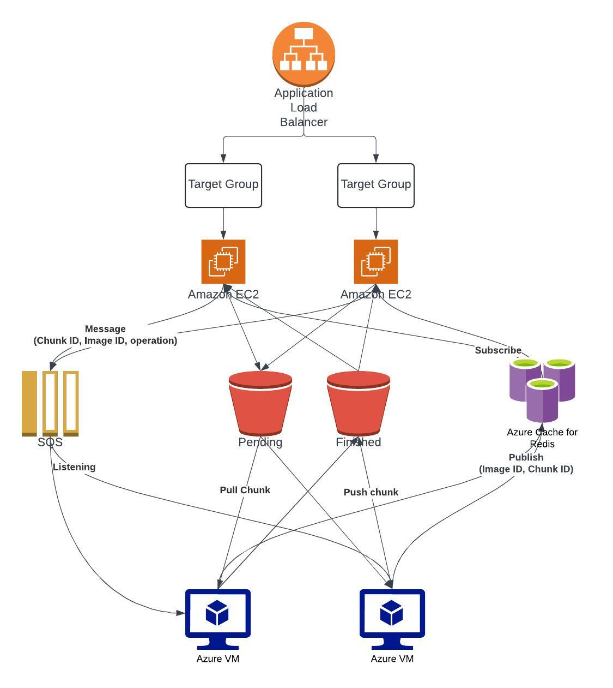

# How to deploy and run

In this documentation, we will discuss the prerequisites and the steps required to deploy and run the website.



## Provisioning

You will need to provision the following services.

- AWS EC2 instances (any number)
- AWS SQS
- Redis server
- VMs for the manager/worker flow

## Top layer

These steps will be following in the top layer

### Config steps

1. Copy the file `.env.example` to a file called `.env` usign the command `cp .env.example .env`.
2. Fill in all the required configurations with the secret keys, hostname, and port.

### Setting up the top layer VMs

In the top layer VMs that hold the web server, create a service to run the flask app. You can use any of the following guides depending on the version of ubuntu.

- [Ubuntu 18.04](https://www.digitalocean.com/community/tutorials/how-to-serve-flask-applications-with-uswgi-and-nginx-on-ubuntu-18-04)
- [Ubuntu 20.04](https://www.digitalocean.com/community/tutorials/how-to-serve-flask-applications-with-uwsgi-and-nginx-on-ubuntu-20-04)
- [Ubuntu 22.04](https://www.digitalocean.com/community/tutorials/how-to-serve-flask-applications-with-gunicorn-and-nginx-on-ubuntu-22-04)

You can alternatively follow the following guide.

1. Install the required dependencies
   ```bash
   sudo apt update
   sudo apt install python3-pip python3-dev build-essential libssl-dev libffi-dev python3-setuptools
   ```
2. In the project folder:
   ```bash
   sudo apt install python3-venv
   mkdir ~/myproject
   cd ~/myproject
   python3 -m venv myprojectenv
   source myprojectenv/bin/activate
   pip install wheel
   pip install gunicorn flask
   sudo ufw allow 5000
   ```
3. Create a service to auto run

   ```bash
   sudo nano /etc/systemd/system/myproject.service
   ```

   Fill it with the following

   ```
   [Unit]
   Description=Gunicorn instance to serve myproject
   After=network.target

   [Service]
   User=ubuntu
   Group=www-data
   WorkingDirectory=/home/ubuntu/myproject
   Environment="PATH=/home/ubuntu/myproject/myprojectenv/bin"
   ExecStart=/home/ubuntu/myproject/myprojectenv/bin/gunicorn --workers 3 --bind unix:myproject.sock -m 007 wsgi:app

   [Install]
   WantedBy=multi-user.target
   ```

   Run the following

   ```bash
   sudo systemctl start myproject
   sudo systemctl enable myproject
   sudo systemctl status myproject
   ```

4. Configuring nginx

   ```bash
   sudo nano /etc/nginx/sites-available/myproject
   ```

   Fill it with the following

   ```
   server {
       listen 80;
       server_name your_domain www.your_domain;

       location / {
           include proxy_params;
           proxy_pass http://unix:/home/ubuntu/myproject/myproject.sock;
       }
   }
   ```

   Run the following

   ```bash
   sudo ln -s /etc/nginx/sites-available/myproject /etc/nginx/sites-enabled
   sudo nginx -t
   sudo systemctl restart nginx
   sudo ufw delete allow 5000
   sudo ufw allow 'Nginx Full'
   ```

### Pushing the source code to VMs

You can push the source code to each machine using

```bash
rsync -avz --exclude="venv" --exclude="__pycache__" -e "ssh -i ~/.ssh/my-ssh-key.pem" ./ ubuntu@machine1:/home/ubuntu/app
```

### Installing dependencies

In each vm, ssh into `/home/ubuntu/myproject` and run the following:

```
source myprojectenv/bin/activate
pip install flask pillow Flask-Cors uuid boto3 pyjwt numpy redis python-dotenv
```

Restart the VM and everything should be working

## Bottom layer

In the bottom layer we would only need follow the steps to install MPI, configure passwordless ssh authentication between the workers and the manager, and run the program as a cronjob.

### Installing MPI

You can install MPI using either of the following two ways

- **[Recommended]** run `sudo apt install mpich`
- or use the official mpich guide to download, make, and install it the machine. **However, this is not recommended as it takes hours to finish**

### Setting up MPI cluster

You can follow [this guide](https://mpitutorial.com/tutorials/running-an-mpi-cluster-within-a-lan/) to setup an MPI cluster or alternatively follow our guide as follows.

1. Add all the ip addresses of all the machines on each other
   `sudo nano /etc/hosts`
   Example

   ```
   127.0.0.1        localhost

   #MPI CLUSTER SETUP
   172.50.88.22     manager
   172.50.88.56     worker1
   172.50.88.34     worker2
   172.50.88.54     worker3
   172.50.88.60     worker4
   172.50.88.46     worker5
   ```

2. Setting up SSH
   ```bash
   sudo apt­-get install openssh-server
   ssh-keygen -t dsa
   ssh-copy-id worker1
   ssh-copy-id worker2
   ssh-copy-id worker3
   ssh-copy-id worker4
   # ...
   ```
3. Enable passwordless ssh
   ```bash
   eval `ssh-agent`
   ssh-add ~/.ssh/id_dsa
   ssh worker1
   ? yes
   exit
   ssh worker2
   ? yes
   exit
   ssh worker3
   ? yes
   exit
   ssh worker4
   ? yes
   exit
   # ...
   ```
4. Setting up NFS On the manager
   ```bash
   sudo apt-get install nfs-kernel-server
   mkdir cloud
   echo '/home/ubuntu/cloud *(rw,sync,no_root_squash,no_subtree_check)' >> /etc/exports
   exportfs -a
   sudo service nfs-kernel-server restart
   ```
5. Setting up NFS On the workers (do the same for each worker)
   ```bash
   sudo apt-get install nfs-common
   mkdir cloud
   sudo mount -t nfs manager:/home/ubuntu/cloud ~/cloud
   df -h
   echo 'manager:/home/ubuntu/cloud /home/ubuntu/cloud nfs' >> /etc/fstab
   ```

### Creating a cronjob

You need to create a cronjob to start the ssh agent, add the ssh-key to the agent, and run the source code whenever the VM restart.

```bash
crontab -e
```

Then add the following at the end of the file (after updating it as fits with your system)

```
@reboot eval `ssh-agent` && ssh-add ~/.ssh/id_rsa && cd /home/ubuntu/cloud && mpiexec -n 4 -env AWS_ACCESS_KEY_ID <AWS_ACCESS_KEY_ID> -env AWS_SECRET_ACCESS_KEY <AWS_SECRET_ACCESS_KEY> -env AWS_REGION <AWS_REGION> -env REDIS_HOST <REDIS_HOST> -env REDIS_PORT <REDIS_PORT> -env REDIS_PASSWORD <REDIS_PASSWORD> -hosts manager,worker1,worker2,worker3 venv/bin/python top.py
```

### Pushing the source code to the VMs

You can push the source code to each machine using

```bash
rsync -avz --exclude="venv" --exclude="__pycache__" -e "ssh -i ~/.ssh/my-ssh-key.pem" ./ ubuntu@manager:/home/ubuntu/cloud
```

### Installing dependencies

In the manager vm ssh into `/home/ubuntu/cloud` and run the following:

```
python3 -m venv venv
source venv/bin/activate
pip install boto3 opencv-python-headless pyjwt numpy redis python-dotenv
```

Restart all the VMs (starting with the workers and restart the manager after all the workers are running) and everything should be working.
